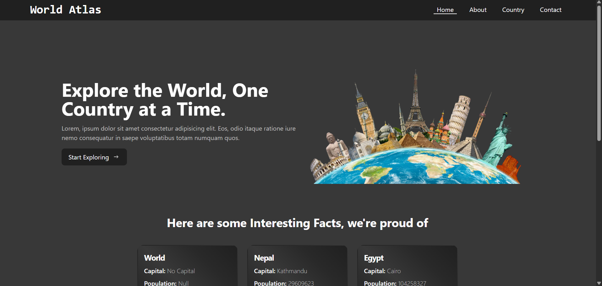
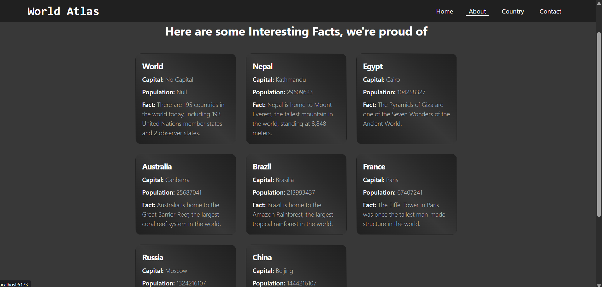
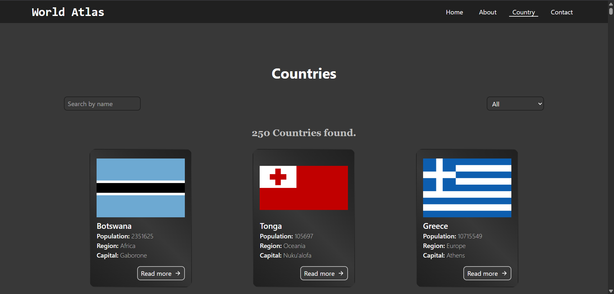
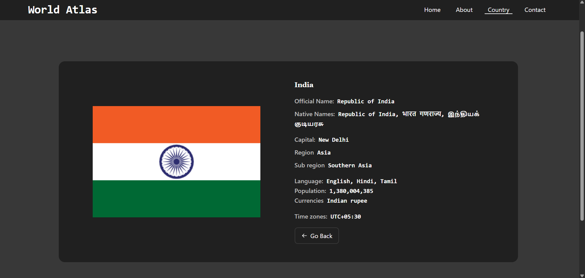
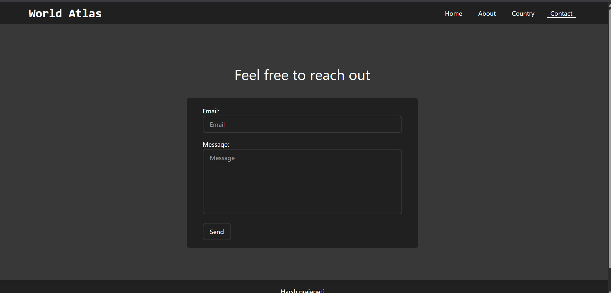

# 🌍 World Tour

World Tour is a React single-page application (SPA) that allows users to browse and explore detailed information about countries around the globe. Built with Vite for lightning-fast performance and modern tooling, this project combines:

> - structured design,
> - reusable components,
> - clean API usage.

## 🔧 Features

- 🔍 Explore All Countries: Lists countries using local JSON and provides rich details for each.

- 🧭 Dynamic Routing: Every country has its own detailed page using URL-based routing.

- 🧱 Component Architecture: Modular and reusable UI components (Header, Footer, Cards, Loaders).

- 🖼️ Responsive Design: Mobile-friendly with TailwindCSS.

- ⚙️ API Integration Ready: Configured for REST Countries API .

## 📸 Preview and Live Preview

> Live Preview: [Live](https://dothpworldtour.netlify.app/)

Preview Image






## 💬 Pages Included:

- Home

- Country List

- Country Detail

- About

- Contact

📁 Project Structure

```
world_tour/
│
├── public/                   # Static assets
│   ├── preview/
│   └── images/
│
├── src/
│   ├── api/
│   │   ├── countryApi.js     # Axios setup (REST Countries API - not currently used)
│   │   └── countryData.json  # Static dataset of countries facts to show in about page
│   │
│   ├── components/
│   │   ├── about/            # About page components
│   │   ├── country/          # CountryCard component
│   │   └── ui/               # Header, Footer, Loader components
│   │
│   ├── pages/                # React page components
│   │   ├── Home.jsx
│   │   ├── Country.jsx
│   │   ├── CountryDetail.jsx
│   │   ├── About.jsx
│   │   ├── Contact.jsx
│   │
│   ├── App.jsx               # Main router + layout
│   ├── index.css             # CSS for app
│   └── main.jsx              # App entry point
│
├── index.html
├── package.json
├── vite.config.js
└── eslint.config.js
```

## 🧠 Routing Overview

React Router is used to define and manage the application's routes:

```js
<Routes>
  <Route path="/" element={<Home />} />
  <Route path="/about" element={<About />} />
  <Route path="/contact" element={<Contact />} />
  <Route path="/countries" element={<Country />} />
  <Route path="/country/:id" element={<CountryDetail />} />
</Routes>
```

## 📦 Installation

Prerequisites:

```
- Node.js (v16+ recommended)

- npm or yarn
```

Steps:

```bash
# Clone the repo

git clone https://github.com/dothp-harshu/world_tour.git
cd world_tour

# Install dependencies

npm install

# Run the development server

npm run

# Build for Production

npm run build
```

## 📝 License

> This project is licensed under the MIT License. See LICENSE for details.

## ✨ Contributing

Feel free to contribute by suggesting improvements or adding new sections! Fork the repository and submit a pull request. 🚀

### 📬 **Let's Connect**

- **GitHub**: [dothp-harshu](https://github.com/dothp-harshu)
- **Instagram**: [@btw*harsh*](https://instagram.com/btw_harsh_)
- **Linkedin**: [/dothp](https://linkedin.com/in/dothp)
- **Email**: [Email](mailto:harshprajapaticoding@gmail.com)

---
